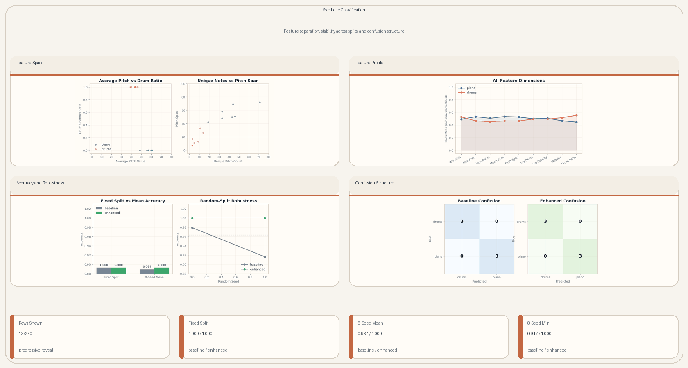
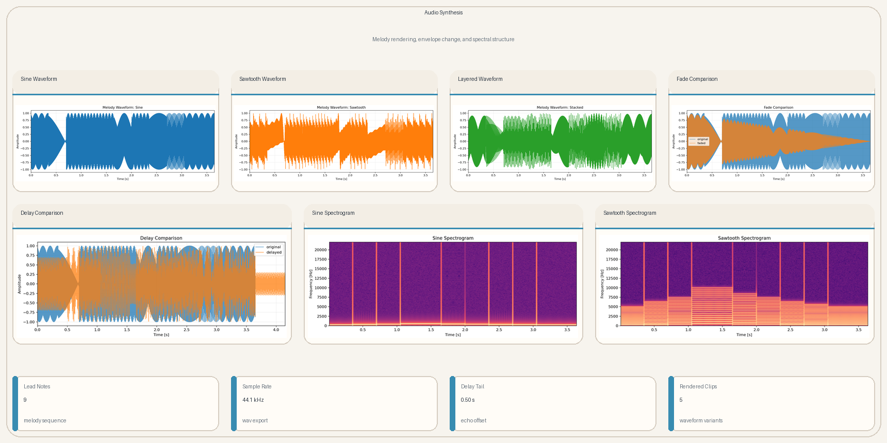
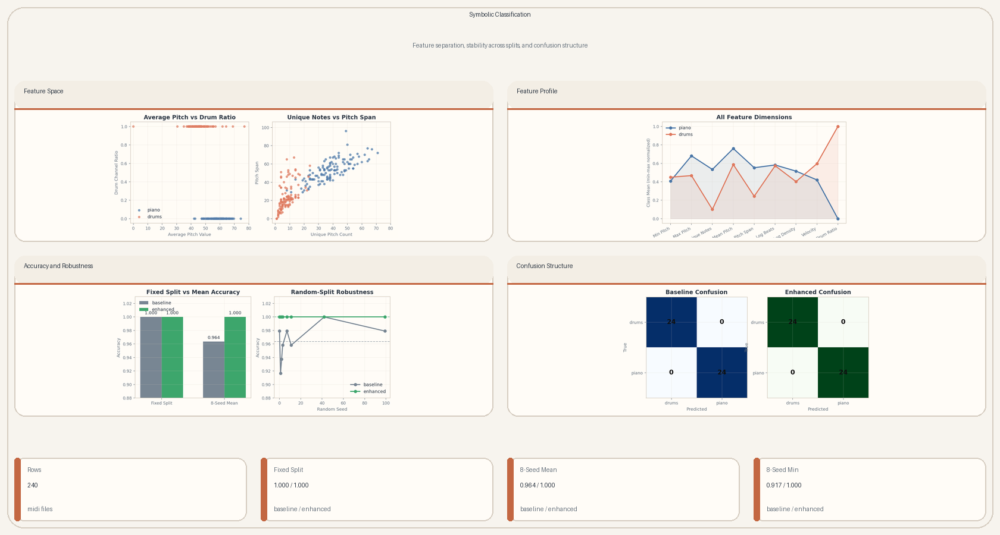
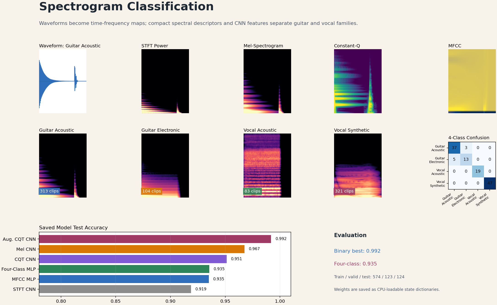

# Music Intelligence

## Abstract

This project presents three connected music intelligence pipelines that move from signal generation to symbolic analysis and audio classification. The first pipeline synthesizes note sequences as sine and sawtooth waveforms, then applies fade, delay, and layered mixing so waveform envelopes and harmonic structure can be inspected directly. The second pipeline classifies symbolic MIDI files by extracting pitch, duration, velocity, density, and drum-channel descriptors, then comparing compact baseline features with an enhanced logistic regression representation. The third pipeline performs spectrogram based instrument classification on audio clips by transforming waveforms into MFCC, STFT, mel-spectrogram, and constant Q features, training neural classifiers, and extending the task from binary guitar vocal recognition to four timbral families. 

## Output Gallery

### Audio Synthesis


The synthesis summary follows one melody through pure sinusoidal rendering, harmonic enrichment, amplitude decay, delay, and layering so the waveform envelope and spectral content can be read together.

### Symbolic Classification



The classification summary shows where `piano` and `drums` separate in symbolic feature space, how the full feature vector differs between the two classes, and why the expanded descriptor remains stable across alternate train/test splits.

### Spectrogram Classification


The spectrogram summary follows audio from waveform to time-frequency features, compares class signatures for acoustic/electronic guitar and acoustic/synthetic voice, and shows how the saved models perform on the fixed evaluation split.

## Setup

From the project root:

```bash
cd /mntdatalora/src/Music-Intelligence
pip install -r requirements.txt
```

Core dependencies:

- `numpy`
- `scipy`
- `mido`
- `scikit-learn`
- `matplotlib`
- `imageio`
- `Pillow`
- `nbformat`
- `torch`
- `torchaudio`
- `librosa`
- `soundfile`

## Data Layout

Input bundle:

```text
data/
  sine_wave_binary_classification/
    input.wav
    output.wav
    piano.zip
    drums.zip
    piano/
    drums/
  spectrogram_classification/
    nsynth_subset/
    nsynth_subset.tar.gz
```

Generated outputs:

```text
outputs/
  sine_wave_binary_classification/
    sine_wave/
    binary_classification/
    visuals/
      audio/
      classifier/
    readme/
    evaluation/
  spectrogram_classification/
    weights/
    evaluation/
    visuals/
      features/
      models/
    readme/
```

The MIDI utilities search the provided data bundle first, automatically extract `piano.zip` and `drums.zip` when needed, and then write project outputs into separate directories for rendered audio, classifier artifacts, raw visuals, README-ready panels, and compact evaluation summaries. The spectrogram utilities resolve the NSynth subset from either the extracted folder or archive, save CPU-loadable model weights, and render feature, training, confusion-matrix, and README panels.

## Execution Order

Typical end-to-end run:

```bash
python scripts/sine_wave/build_audio_gallery.py
python scripts/visualiser/render_audio_gallery.py
python scripts/binary_classify/train_midi_classifier.py --max-files 120
python scripts/visualiser/render_classifier_gallery.py --max-files 120
python scripts/visualiser/render_spectrogram_gallery.py
python evaluation/compute_metrics.py
python scripts/build_readme_panels.py
```

Optional:

```bash
python scripts/visualiser/render_evaluation_gallery.py --max-files 120
```

Spectrogram specific model artifacts can be regenerated with:

```bash
python scripts/spectrogram_classification/train_notebook_weights.py --module-name spectrogram_classification --device cpu
python scripts/visualiser/render_spectrogram_gallery.py
```

## Audio Synthesis

### Model

For a melody represented as an ordered note-duration sequence

```math
\mathcal{M} = \{(m_i, d_i)\}_{i=1}^{L},
```

the note-frequency conversion follows the equal-tempered relation

```math
f(m) = 440 \cdot 2^{\frac{m - 69}{12}},
```

where `m` is the MIDI note number implied by the note name. The base sine renderer for one note is

```math
x_i(t) = \sin(2 \pi f(m_i) t), \qquad 0 \le t < d_i,
```

and the sawtooth approximation adds 18 upper harmonics:

```math
x^{(i)}_{\text{saw}}(t) = \frac{2}{\pi} \sum_{k=1}^{19} \frac{(-1)^{k+1}}{k} \sin(2 \pi k f(m_i) t).
```

The full melody is created by time concatenation

```math
x_{\text{melody}} = x_1 \oplus x_2 \oplus \cdots \oplus x_L,
```

and the effect stage applies a linear fade, a discrete delay, and a weighted simultaneous mix:

```math
x_{\text{fade}}[n] = \left(1 - \frac{n}{N-1}\right) x[n],
```

```math
x_{\text{delay}}[n] = x[n] + \alpha x[n-d]\mathbf{1}[n \ge d],
```

```math
x_{\text{mix}}[n] = \sum_{i=1}^{K} g_i x_i[n].
```

With sample rate `f_s` and delay time `\tau`, the offset is `d = \lfloor \tau f_s \rfloor`. The audio section is therefore organized around waveform, envelope, and spectrogram views because the pipeline changes both amplitude over time and harmonic energy across frequency.

### Static Panel



### Current Metrics

| Artifact | Duration [s] | Role |
| --- | ---: | --- |
| `melody_sine.wav` | `3.65` | base melody rendered with sine waves |
| `melody_sawtooth.wav` | `3.65` | harmonic melody rendered with the sawtooth series |
| `melody_faded.wav` | `3.65` | linearly decayed melody |
| `melody_delayed.wav` | `4.15` | original melody plus `0.50 s` echo tail |
| `melody_stacked.wav` | `3.65` | simultaneous layered mix of lead and pad voices |

## Symbolic Classification

### Model

Each MIDI file is summarized into symbolic note statistics rather than raw audio features. The baseline vector is

```math
x_{\text{base}} = [p_{\min},\; p_{\max},\; n_{\text{unique}},\; \bar{p}],
```

and the expanded vector is

```math
x_{\text{enh}} = [p_{\min},\; p_{\max},\; n_{\text{unique}},\; \bar{p},\; p_{\text{span}},\; \log(1+b),\; \log(1+\rho),\; \bar{v}/127,\; r_{\text{drum}}],
```

with

```math
p_{\text{span}} = p_{\max} - p_{\min}, \qquad
b = \frac{T_{\max}}{\text{ticks per beat}}, \qquad
\rho = \frac{N}{b}, \qquad
r_{\text{drum}} = \frac{N_{\text{channel 9}}}{N}.
```

The standardized classifier is

```math
\tilde{x}_j = \frac{x_j - \mu_j}{\sigma_j},
```

followed by logistic regression:

```math
z = w^\top \tilde{x} + \beta, \qquad P(y = 1 \mid x) = \sigma(z),
```

with decision rule

```math
\hat{y} =
\begin{cases}
1 & \text{if } z > 0 \\
0 & \text{otherwise}
\end{cases}
```

where `y = 1` denotes `piano` and `y = 0` denotes `drums`.

Feature definitions:

| Feature | Meaning | Why it helps |
| --- | --- | --- |
| `lowest_pitch`, `highest_pitch` | minimum and maximum active note numbers | separates narrow drum pitch sets from wider piano ranges |
| `unique_pitch_num` | number of distinct note values | captures pitch diversity |
| `average_pitch_value` | mean of unique active pitches | shifts piano files toward tonal centers |
| `pitch_span` | `highest_pitch - lowest_pitch` | measures melodic range |
| `log_beats` | `log(1 + beat_count)` | normalizes long symbolic sequences |
| `log_note_density` | `log(1 + note_count / beat_count)` | captures event density per beat |
| `average_velocity_norm` | mean velocity divided by `127` | reflects attack intensity |
| `drum_channel_ratio` | fraction of active notes on MIDI channel `9` | strong drum-specific structural cue |

The panel combines low-dimensional scatter views with the full nine-feature profile so the separation is not reduced to a single score.

### Static Panel



### Current Metrics

| Evaluation | Baseline | Enhanced | Interpretation |
| --- | ---: | ---: | --- |
| fixed split (`random_state = 42`) | `1.000` | `1.000` | both models separate the saved split perfectly |
| 8-seed sweep mean | `0.964` | `1.000` | the enhanced vector stays saturated across alternate train/test splits |
| 8-seed sweep minimum | `0.917` | `1.000` | the baseline drops on harder splits while the enhanced model does not |

So the apparent `1.0 / 1.0` tie in the saved confusion matrices is real for that specific split, but it is not the whole story. The expanded timing, velocity, and drum-channel features improve robustness once the train/test partition changes.

## Spectrogram Classification

### Model

Each audio clip is represented as a discrete waveform

```math
x[n], \qquad 0 \le n < N,
```

loaded as mono audio and resampled for the feature pipeline. The first view is the short-time Fourier transform:

```math
X[k, m] = \sum_{n=0}^{N-1} x[n]\,w[n-mH]\,e^{-j2\pi kn/K},
```

where `w` is the analysis window, `H` is the hop length, `K` is the FFT size, `k` indexes frequency bins, and `m` indexes time frames. The linear spectrogram used by the CNN is the power map

```math
S[k, m] = |X[k, m]|^2.
```

The mel representation compresses frequency with triangular perceptual filters:

```math
M[b, m] = \sum_k B_{b,k}S[k,m],
```

then maps power to decibel space and normalizes each clip:

```math
D[b,m] = 10\log_{10}\left(\frac{\max(M[b,m], \epsilon)}{\max_{b,m}M[b,m]}\right).
```

MFCC features summarize the log-mel envelope with a cosine basis:

```math
c_r[m] = \sum_{b=1}^{B} D[b,m]\cos\left(\frac{\pi r(b-1/2)}{B}\right),
```

and the MLP input concatenates per-coefficient means and standard deviations:

```math
\phi_{\text{MFCC}}(x) =
[\mu(c_1), \ldots, \mu(c_R), \sigma(c_1), \ldots, \sigma(c_R)].
```

The constant-Q transform uses logarithmically spaced center frequencies

```math
f_q = f_{\min}2^{q/B},
```

so its bins align more naturally with musical pitch intervals. For augmentation, pitch shifting creates additional waveforms

```math
x_{\Delta}[n] = \operatorname{PitchShift}(x[n], \Delta),
```

with `\Delta = +1` and `\Delta = -1` semitone while preserving the class label.

For each feature function `\phi`, a neural classifier predicts logits

```math
z = f_{\theta}(\phi(x)),
```

and class probabilities are produced with softmax:

```math
P(y=c \mid x) = \frac{e^{z_c}}{\sum_j e^{z_j}}.
```

Training minimizes cross-entropy:

```math
\mathcal{L}(\theta) =
-\frac{1}{B}\sum_{i=1}^{B}\log P(y_i \mid x_i).
```

The binary task separates `guitar` from `vocal`. The extended model separates four timbral families:

```text
guitar_acoustic, guitar_electronic, vocal_acoustic, vocal_synthetic
```

The final four-class model uses a compact spectral-statistics representation with MFCC, mel, spectral contrast, centroid, bandwidth, rolloff, flatness, zero-crossing rate, and RMS summaries. This feature vector is paired with a batch-normalized MLP, which improves the acoustic/electronic guitar separation that was weak with a plain mel CNN.

### Static Panel



### Current Metrics

| Model | Feature View | Classes | Test Accuracy | Notes |
| --- | --- | ---: | ---: | --- |
| `mfcc_mlp` | MFCC statistics | 2 | `0.9350` | compact cepstral baseline |
| `spectrogram_cnn` | STFT power spectrogram | 2 | `0.9187` | direct linear-frequency image |
| `mel_spectrogram_cnn` | mel-spectrogram | 2 | `0.9675` | strongest non-augmented binary CNN |
| `cqt_cnn` | constant-Q transform | 2 | `0.9512` | pitch-spaced spectral evidence |
| `augmented_cqt_cnn` | CQT with pitch-shift augmentation | 2 | `0.9919` | best binary model |
| `four_class_cnn` | spectral-statistics MLP | 4 | `0.9355` | four-family classifier |

The four-class confusion matrix is concentrated on the diagonal. The remaining errors are mostly between `guitar_acoustic` and `guitar_electronic`, which is the hardest pair because they share pitch range and decay profile but differ in timbral detail.

## Evaluation

The evaluation folder stays table-first:

| Metric | Value |
| --- | ---: |
| `audio_clip_count` | `5` |
| `lead_note_count` | `9` |
| `sample_rate` | `44100` |
| `delay_tail_seconds` | `0.5000` |
| `baseline_accuracy` | `1.0000` |
| `enhanced_accuracy` | `1.0000` |
| `baseline_seed_sweep_mean` | `0.9635` |
| `enhanced_seed_sweep_mean` | `1.0000` |
| `baseline_seed_sweep_min` | `0.9167` |
| `enhanced_seed_sweep_min` | `1.0000` |
| `row_count` | `240` |
| `spectrogram_clip_count` | `821` |
| `spectrogram_binary_best_accuracy` | `0.9919` |
| `spectrogram_four_class_accuracy` | `0.9355` |

## License

This project is released under the MIT License. See [LICENSE](LICENSE).
