# Music Intelligence

## Abstract

Modern music intelligence requires models that can move between incompatible musical representations: phase aware audio, time frequency spectra, symbolic note events, multi instrument arrangements, and listener driven playlist behavior. The work in this repository studies that problem as a connected modeling stack rather than as a set of isolated demonstrations. The emphasis is on generative and decision making systems whose behavior can be inspected through visual evidence, structured artifacts, and reproducible evaluation.

The central audio generation component is a pitch conditioned flow matching model for diffusion based music synthesis. A pretrained spectrogram generator is adapted to guitar audio, sampled with classifier free guidance and numerical ODE solvers, and improved at inference time through pitch guided candidate selection. Instead of treating generation as a single final spectrogram, the visualization follows samples through the learned flow field, showing how noise is organized into harmonic structure and how that structure becomes a waveform.

The symbolic and sequence components model music above the audio level. Markov models capture monophonic pitch and rhythm structure for melody generation, while a multitrack Transformer learns coordinated event sequences for piano, guitar, bass, strings, and brass. Automatic instrumentation is framed as note level part assignment from a mixed symbolic stream, comparing rule based, feed forward, recurrent, bidirectional, and Transformer arrangers with prediction roll views and confusion matrix evidence.

The recommendation component adds listener context to the same music intelligence setting. Playlist continuation is formulated as implicit feedback retrieval, where collaborative structure is used to rank hidden continuation tracks from a short query seed and is compared against an audio embedding baseline. Together, the systems show how audio generation, symbolic modeling, arrangement, classification, and recommendation can be developed and evaluated within one reproducible workflow.

## Output Gallery

### Diffusion-Based Music Generation

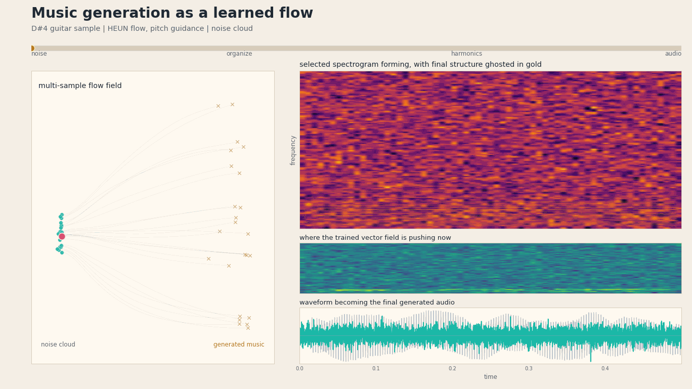

The diffusion summary shows multiple generated spectrograms moving through the learned flow field while one selected guitar sample is tracked from noise to pitched audio. The animation pairs the projected flow path with the current spectrogram, vector-field energy, and reconstructed waveform so the formation of harmonic structure can be inspected over diffusion steps.

### Symbolic Classification

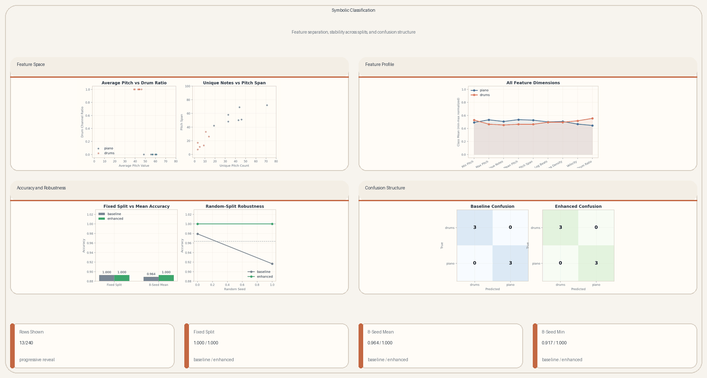

The classification summary shows where `piano` and `drums` separate in symbolic feature space, how the full feature vector differs between the two classes, and why the expanded descriptor remains stable across alternate train/test splits.

### Spectrogram Classification


The spectrogram summary follows audio from waveform to time frequency features, compares class signatures for acoustic/electronic guitar and acoustic/synthetic voice, and shows how the saved models perform on the fixed evaluation split.

### Symbolic Music Generation

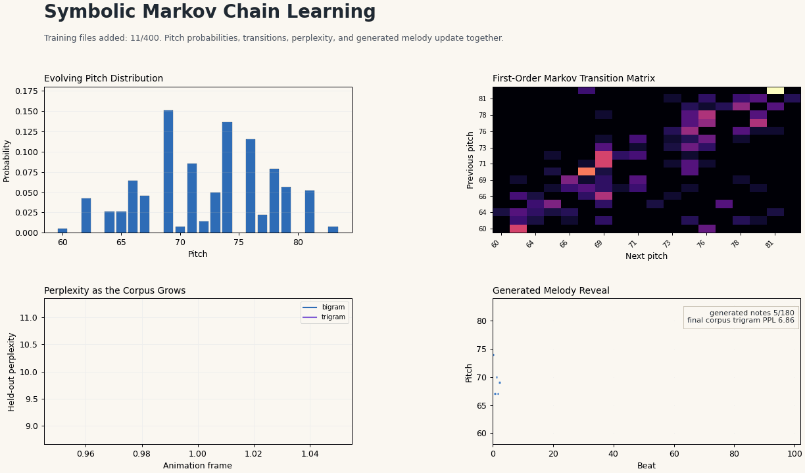

The generation summary shows the Markov model improving as more MIDI files enter the corpus: pitch probabilities stabilize, transition structure becomes clearer, perplexity changes over time, and the sampled melody is revealed as a piano roll sequence.

### Multitrack Transformer Generation

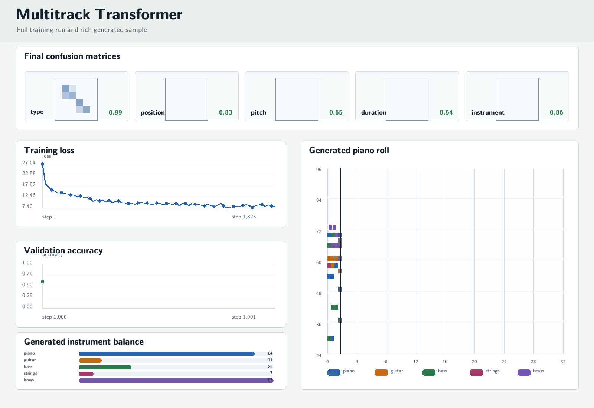

The multitrack summary shows final confusion matrices, training curves, generated piano roll, and instrument balance for the selected rich sample.

### Automatic Instrumentation

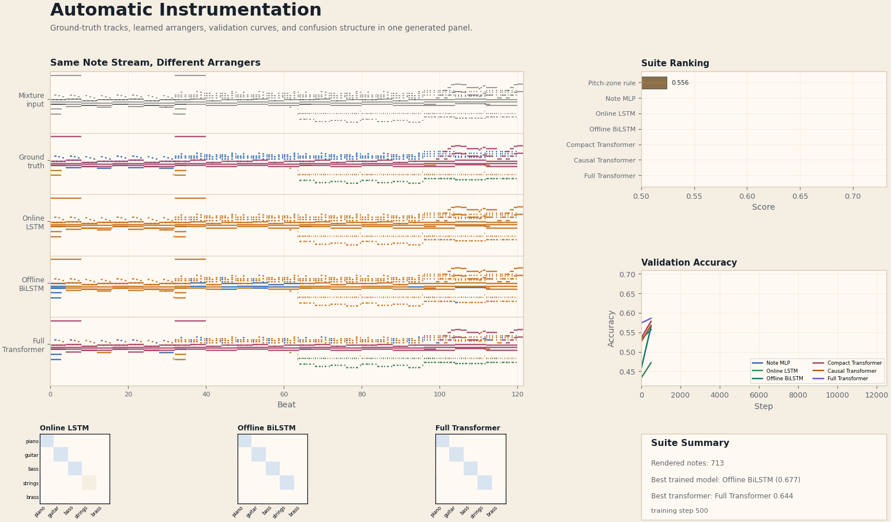

The instrumentation summary follows the same symbolic note stream through saved training checkpoints: online LSTM, offline BiLSTM, and Transformer predictions evolve while suite scores, validation curves, and confusion matrices update in the same view.

### Automatic Playlist Continuation

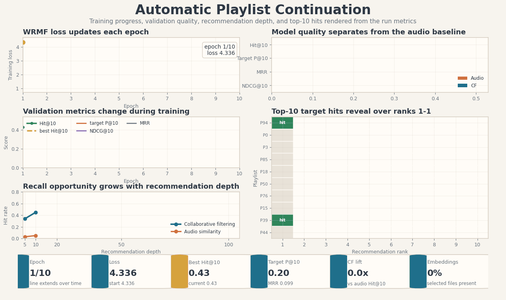

The playlist continuation summary animates the actual run metrics over time: WRMF loss moves epoch by epoch, validation Hit@10 and rank metrics update during training, recommendation depth curves reveal progressively, and the top 10 hit grid exposes which held out target tracks appear in the ranked continuation list.

### Audio Synthesis


The synthesis summary follows one melody through pure sinusoidal rendering, harmonic enrichment, amplitude decay, delay, and layering so the waveform envelope and spectral content can be read together.

## Setup

From the project root:

```bash
cd /mntdatalora/src/Music-Intelligence
pip install -r requirements.txt
```

Core dependencies:

- `numpy`
- `scipy`
- `mido`
- `scikit-learn`
- `matplotlib`
- `imageio`
- `Pillow`
- `nbformat`
- `torch`
- `torchaudio`
- `librosa`
- `soundfile`
- `miditok`
- `symusic`
- `MIDIUtil`

## Data Layout

Input bundle:

```text
data/
  sine_wave_binary_classification/
    input.wav
    output.wav
    piano.zip
    drums.zip
    piano/
    drums/
  spectrogram_classification/
    nsynth_subset/
    nsynth_subset.tar.gz
  symbolic_music_generation/
    PDMX_subset.zip
    PDMX_subset/
  diffusion_based_music_generation/
    homework4_stub.ipynb
    dataset.py
    model.py
    pretrained_keyboard.pt
    nsynth/
      nsynth-valid/
        audio/
  automatic_playlist_continuation/
    train_playlists.json
    test_playlists.json
    audio_embeddings.zip
    audio_embeddings/
    homework5 stub.ipynb
```

Generated outputs:

```text
outputs/
  sine_wave_binary_classification/
    sine_wave/
    binary_classification/
    visuals/
      audio/
      classifier/
    readme/
    evaluation/
  spectrogram_classification/
    weights/
    evaluation/
    visuals/
      features/
      models/
    readme/
  symbolic_music_generation/
    generated/
    metrics/
    tables/
    evaluation/
    visuals/
    readme/
  automatic_music_instrumentation/
    main_training_20260418_191121/
      runs/
      model_suite/
      visual/
  multitrack_generation/
    runs/
    evaluation/
    generated/
    visuals/
    readme/
  diffusion_based_music_generation/
    runs/
    generated/
    evaluation/
    beat_baseline_pitch_guided/
    visuals/
      music_forming_flow/
  automatic_playlist_continuation/
    full_run_20260422_002634/
      models/
      metrics/
      rankings/
      synthesis/
      visuals/
      readme/
```

The MIDI utilities search the provided data bundle first, automatically extract `piano.zip` and `drums.zip` when needed, and then write project outputs into separate directories for rendered audio, classifier artifacts, raw visuals, presentation panels, and compact evaluation summaries. The spectrogram utilities resolve the NSynth subset from either the extracted folder or archive, save CPU loadable model weights, and render feature, training, and confusion matrix views. The symbolic generation utilities resolve the PDMX subset, build Markov pitch and rhythm tables, and write `q10.mid`. The multitrack utilities train the Transformer, evaluate the checkpoint, search generation settings, and render gallery assets under `outputs/multitrack_generation`. The diffusion generation utilities keep the assignment bundle in `data/diffusion_based_music_generation` read only, copy needed model code into `scripts/diffusion_based_music_generation`, fine tune the provided keyboard checkpoint on guitar audio, generate pitch-conditioned samples, score candidate generations, and render flow visualizations under `outputs/diffusion_based_music_generation`. The automatic playlist continuation utilities read train/test playlist JSON, extract the needed audio embeddings, train and evaluate the WRMF recommender, save ranking previews, render improved WAV evidence, and build panels under the selected `full_run_*` directory. The automatic instrumentation utilities read processed note event arrays, train a suite of arrangers, save checkpoint histories, and render final README visuals under the training run's `visual/` directory.

## Execution Order

Typical end to end run:

```bash
python scripts/sine_wave/build_audio_gallery.py
python scripts/visualiser/render_audio_gallery.py
python scripts/binary_classify/train_midi_classifier.py --max-files 120
python scripts/visualiser/render_classifier_gallery.py --max-files 120
python scripts/visualiser/render_spectrogram_gallery.py
python scripts/symbolic_music_generation/build_markov_outputs.py
python scripts/visualiser/render_symbolic_generation_gallery.py
python scripts/visualiser/render_automatic_instrumentation_gallery.py --suite-root outputs/automatic_music_instrumentation/main_training_20260418_191121
python -m scripts.visualiser.render_multitrack_generation_gallery --training-run-name full_transformer --generated-name full_transformer_rich_selected
python -m scripts.diffusion_based_music_generation.workflows.run_pipeline --run-name q4_full_guitar --instrument-filter guitar --max-files 2000 --epochs 300 --max-train-steps 0 --batch-size 64 --sampler heun --n-samples 100 --n-steps 50 --guidance-scale 6.0 --skip-smoke
python scripts/diffusion_based_music_generation/workflows/beat_baseline_pitch_guided.py
python scripts/visualiser/render_diffusion_generation_gallery.py --frame-count 12 --flow-samples 24 --frame-duration 0.28
python -m scripts.automatic_playlist_continuation.workflows.prepare_embeddings --playlist-tracks-only --summary-path outputs/automatic_playlist_continuation/full_run_20260422_002634/metrics/embedding_summary.json
python evaluation/evaluate_playlist_continuation.py --output-dir outputs/automatic_playlist_continuation/full_run_20260422_002634/metrics --ranking-dir outputs/automatic_playlist_continuation/full_run_20260422_002634/rankings
python -m scripts.automatic_playlist_continuation.workflows.train_collaborative_filtering --output-dir outputs/automatic_playlist_continuation/full_run_20260422_002634/models/wrmf
python -m scripts.automatic_playlist_continuation.workflows.run_synthesis_demo --output-dir outputs/automatic_playlist_continuation/full_run_20260422_002634/synthesis
python -m scripts.visualiser.render_automatic_playlist_continuation_gallery --run-dir outputs/automatic_playlist_continuation/full_run_20260422_002634
python scripts/build_readme_panels.py --suite automatic_playlist_continuation --apc-run-dir outputs/automatic_playlist_continuation/full_run_20260422_002634
python evaluation/compute_metrics.py
python evaluation/evaluate_symbolic_generation.py
python scripts/build_readme_panels.py
```

Optional:

```bash
python scripts/visualiser/render_evaluation_gallery.py --max-files 120
```

Spectrogram specific model artifacts can be regenerated with:

```bash
python scripts/spectrogram_classification/train_notebook_weights.py --module-name spectrogram_classification --device cpu
python scripts/visualiser/render_spectrogram_gallery.py
```

Multitrack generation artifacts can be regenerated with:

```bash
python -m scripts.multitrack_generation.workflows.evaluate_model --checkpoint outputs/multitrack_generation/runs/full_transformer/checkpoints/best_model.pt --run-name full_transformer
python -m scripts.multitrack_generation.workflows.evaluate_generation_quality --checkpoint outputs/multitrack_generation/runs/full_transformer/checkpoints/best_model.pt --run-name full_transformer --generated-path outputs/multitrack_generation/generated/full_transformer_rich_selected --search --search-name full_transformer_rich_selected --prompts all_instruments --num-search-samples 28 --max-seq-len 640 --min-notes 128
python -m scripts.visualiser.render_multitrack_generation_gallery --training-run-name full_transformer --generated-name full_transformer_rich_selected
```

Diffusion based music generation artifacts can be regenerated with:

```bash
python -m scripts.diffusion_based_music_generation.workflows.run_pipeline --run-name q4_full_guitar --instrument-filter guitar --max-files 2000 --epochs 300 --max-train-steps 0 --batch-size 64 --sampler heun --n-samples 100 --n-steps 50 --guidance-scale 6.0 --skip-smoke
python scripts/diffusion_based_music_generation/workflows/beat_baseline_pitch_guided.py
python scripts/visualiser/render_diffusion_generation_gallery.py --frame-count 12 --flow-samples 24 --frame-duration 0.28
```

Automatic playlist continuation artifacts can be regenerated with:

```bash
python -m scripts.automatic_playlist_continuation.workflows.prepare_embeddings --playlist-tracks-only --summary-path outputs/automatic_playlist_continuation/full_run_20260422_002634/metrics/embedding_summary.json
python evaluation/evaluate_playlist_continuation.py --output-dir outputs/automatic_playlist_continuation/full_run_20260422_002634/metrics --ranking-dir outputs/automatic_playlist_continuation/full_run_20260422_002634/rankings
python -m scripts.visualiser.render_automatic_playlist_continuation_gallery --run-dir outputs/automatic_playlist_continuation/full_run_20260422_002634
python scripts/build_readme_panels.py --suite automatic_playlist_continuation --apc-run-dir outputs/automatic_playlist_continuation/full_run_20260422_002634
```

## Audio Synthesis

### Model

For a melody represented as an ordered note duration sequence

```math
\mathcal{M} = \{(m_i, d_i)\}_{i=1}^{L},
```

the note frequency conversion follows the equal tempered relation

```math
f(m) = 440 \cdot 2^{\frac{m - 69}{12}},
```

where `m` is the MIDI note number implied by the note name. The base sine renderer for one note is

```math
x_i(t) = \sin(2 \pi f(m_i) t), \qquad 0 \le t < d_i,
```

and the sawtooth approximation adds 18 upper harmonics:

```math
x^{(i)}_{\text{saw}}(t) = \frac{2}{\pi} \sum_{k=1}^{19} \frac{(-1)^{k+1}}{k} \sin(2 \pi k f(m_i) t).
```

The full melody is created by time concatenation

```math
x_{\text{melody}} = x_1 \oplus x_2 \oplus \cdots \oplus x_L,
```

and the effect stage applies a linear fade, a discrete delay, and a weighted simultaneous mix:

```math
x_{\text{fade}}[n] = \left(1 - \frac{n}{N-1}\right) x[n],
```

```math
x_{\text{delay}}[n] = x[n] + \alpha x[n-d]\mathbf{1}[n \ge d],
```

```math
x_{\text{mix}}[n] = \sum_{i=1}^{K} g_i x_i[n].
```

With sample rate `f_s` and delay time `\tau`, the offset is `d = \lfloor \tau f_s \rfloor`. The audio section is therefore organized around waveform, envelope, and spectrogram views because the pipeline changes both amplitude over time and harmonic energy across frequency.

### Static Panel

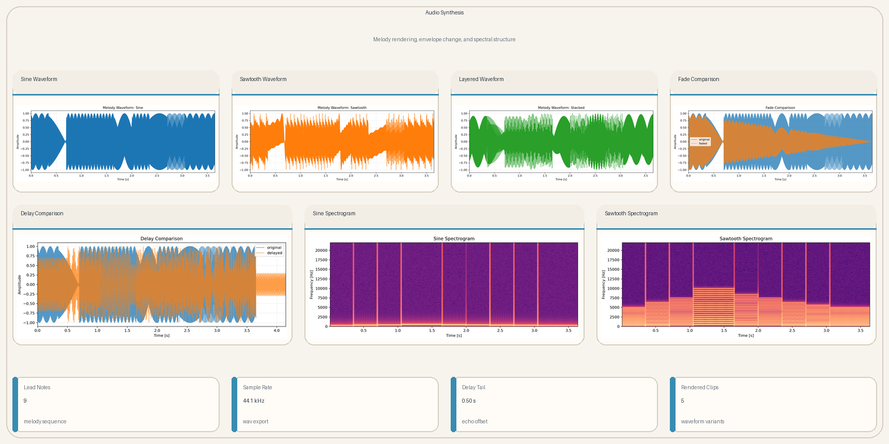

### Current Metrics

| Artifact | Duration [s] | Role |
| --- | ---: | --- |
| `melody_sine.wav` | `3.65` | base melody rendered with sine waves |
| `melody_sawtooth.wav` | `3.65` | harmonic melody rendered with the sawtooth series |
| `melody_faded.wav` | `3.65` | linearly decayed melody |
| `melody_delayed.wav` | `4.15` | original melody plus `0.50 s` echo tail |
| `melody_stacked.wav` | `3.65` | simultaneous layered mix of lead and pad voices |

## Symbolic Classification

### Model

Each MIDI file is summarized into symbolic note statistics rather than raw audio features. The baseline vector is

```math
x_{\text{base}} = [p_{\min},\; p_{\max},\; n_{\text{unique}},\; \bar{p}],
```

and the expanded vector is

```math
x_{\text{enh}} = [p_{\min},\; p_{\max},\; n_{\text{unique}},\; \bar{p},\; p_{\text{span}},\; \log(1+b),\; \log(1+\rho),\; \bar{v}/127,\; r_{\text{drum}}],
```

with

```math
p_{\text{span}} = p_{\max} - p_{\min}, \qquad
b = \frac{T_{\max}}{\text{ticks per beat}}, \qquad
\rho = \frac{N}{b}, \qquad
r_{\text{drum}} = \frac{N_{\text{channel 9}}}{N}.
```

The standardized classifier is

```math
\tilde{x}_j = \frac{x_j - \mu_j}{\sigma_j},
```

followed by logistic regression:

```math
z = w^\top \tilde{x} + \beta, \qquad P(y = 1 \mid x) = \sigma(z),
```

with decision rule

```math
\hat{y} =
\begin{cases}
1 & \text{if } z > 0 \\
0 & \text{otherwise}
\end{cases}
```

where `y = 1` denotes `piano` and `y = 0` denotes `drums`.

Feature definitions:

| Feature | Meaning | Why it helps |
| --- | --- | --- |
| `lowest_pitch`, `highest_pitch` | minimum and maximum active note numbers | separates narrow drum pitch sets from wider piano ranges |
| `unique_pitch_num` | number of distinct note values | captures pitch diversity |
| `average_pitch_value` | mean of unique active pitches | shifts piano files toward tonal centers |
| `pitch_span` | `highest_pitch - lowest_pitch` | measures melodic range |
| `log_beats` | `log(1 + beat_count)` | normalizes long symbolic sequences |
| `log_note_density` | `log(1 + note_count / beat_count)` | captures event density per beat |
| `average_velocity_norm` | mean velocity divided by `127` | reflects attack intensity |
| `drum_channel_ratio` | fraction of active notes on MIDI channel `9` | strong drum specific structural cue |

The panel combines low dimensional scatter views with the full nine feature profile so the separation is not reduced to a single score.

### Static Panel

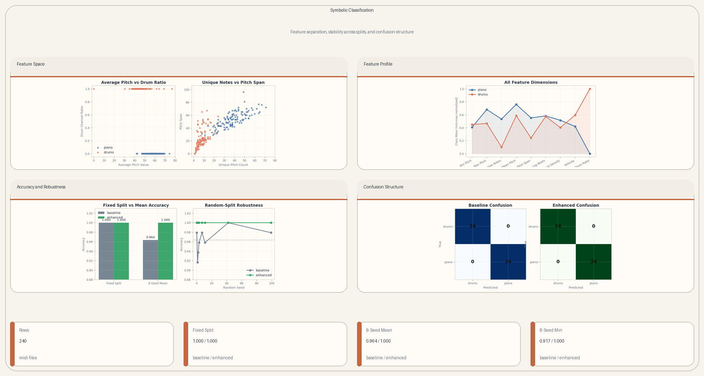

### Current Metrics

| Evaluation | Baseline | Enhanced | Interpretation |
| --- | ---: | ---: | --- |
| fixed split (`random_state = 42`) | `1.000` | `1.000` | both models separate the saved split perfectly |
| 8-seed sweep mean | `0.964` | `1.000` | the enhanced vector stays saturated across alternate train/test splits |
| 8-seed sweep minimum | `0.917` | `1.000` | the baseline drops on harder splits while the enhanced model does not |

So the apparent `1.0 / 1.0` tie in the saved confusion matrices is real for that specific split, but it is not the whole story. The expanded timing, velocity, and drum channel features improve robustness once the train/test partition changes.

## Spectrogram Classification

### Model

Each audio clip is represented as a discrete waveform

```math
x[n], \qquad 0 \le n < N,
```

loaded as mono audio and resampled for the feature pipeline. The first view is the short time Fourier transform:

```math
X[k, m] = \sum_{n=0}^{N-1} x[n]\,w[n-mH]\,e^{-j2\pi kn/K},
```

where `w` is the analysis window, `H` is the hop length, `K` is the FFT size, `k` indexes frequency bins, and `m` indexes time frames. The linear spectrogram used by the CNN is the power map

```math
S[k, m] = |X[k, m]|^2.
```

The mel representation compresses frequency with triangular perceptual filters:

```math
M[b, m] = \sum_k B_{b,k}S[k,m],
```

then maps power to decibel space and normalizes each clip:

```math
D[b,m] = 10\log_{10}\left(\frac{\max(M[b,m], \epsilon)}{\max_{b,m}M[b,m]}\right).
```

MFCC features summarize the log mel envelope with a cosine basis:

```math
c_r[m] = \sum_{b=1}^{B} D[b,m]\cos\left(\frac{\pi r(b-1/2)}{B}\right),
```

and the MLP input concatenates per coefficient means and standard deviations:

```math
\phi_{\text{MFCC}}(x) =
[\mu(c_1), \ldots, \mu(c_R), \sigma(c_1), \ldots, \sigma(c_R)].
```

The constant Q transform uses logarithmically spaced center frequencies

```math
f_q = f_{\min}2^{q/B},
```

so its bins align more naturally with musical pitch intervals. For augmentation, pitch shifting creates additional waveforms

```math
x_{\Delta}[n] = \mathrm{PitchShift}(x[n], \Delta),
```

with `\Delta = +1` and `\Delta = -1` semitone while preserving the class label.

For each feature function `\phi`, a neural classifier predicts logits

```math
z = f_{\theta}(\phi(x)),
```

and class probabilities are produced with softmax:

```math
P(y=c \mid x) = \frac{e^{z_c}}{\sum_j e^{z_j}}.
```

Training minimizes cross entropy:

```math
\mathcal{L}(\theta) =
-\frac{1}{B}\sum_{i=1}^{B}\log P(y_i \mid x_i).
```

The binary task separates `guitar` from `vocal`. The extended model separates four timbral families:

```text
guitar_acoustic, guitar_electronic, vocal_acoustic, vocal_synthetic
```

The final four class model uses a compact spectral statistics representation with MFCC, mel, spectral contrast, centroid, bandwidth, rolloff, flatness, zero crossing rate, and RMS summaries. This feature vector is paired with a batch normalized MLP, which improves the acoustic/electronic guitar separation that was weak with a plain mel CNN.

### Static Panel

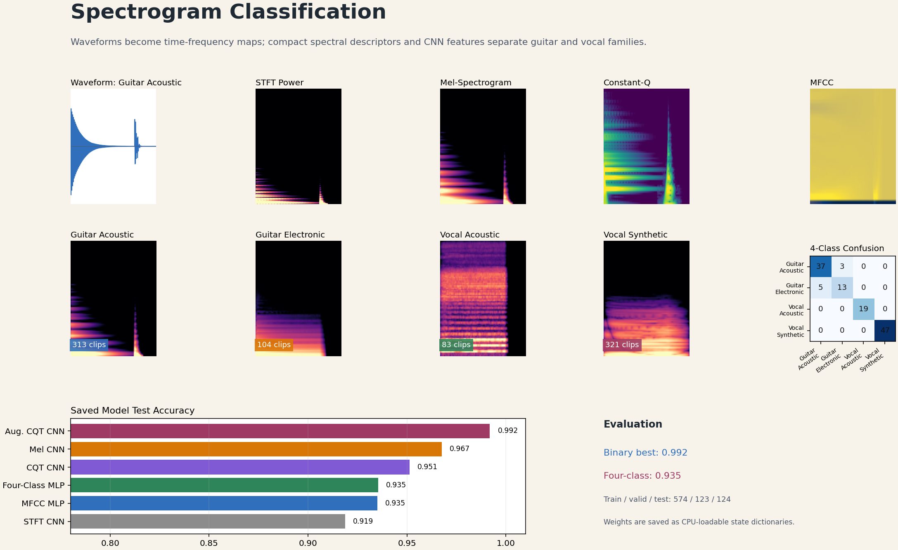

### Current Metrics

| Model | Feature View | Classes | Test Accuracy | Notes |
| --- | --- | ---: | ---: | --- |
| `mfcc_mlp` | MFCC statistics | 2 | `0.9350` | compact cepstral baseline |
| `spectrogram_cnn` | STFT power spectrogram | 2 | `0.9187` | direct linear frequency image |
| `mel_spectrogram_cnn` | mel spectrogram | 2 | `0.9675` | strongest non augmented binary CNN |
| `cqt_cnn` | constant Q transform | 2 | `0.9512` | pitch spaced spectral evidence |
| `augmented_cqt_cnn` | CQT with pitch shift augmentation | 2 | `0.9919` | best binary model |
| `four_class_cnn` | spectral statistics MLP | 4 | `0.9355` | four family classifier |

The four class confusion matrix is concentrated on the diagonal. The remaining errors are mostly between `guitar_acoustic` and `guitar_electronic`, which is the hardest pair because they share pitch range and decay profile but differ in timbral detail.

## Symbolic Music Generation

### Model

Each monophonic MIDI file is converted into an ordered pitch sequence

```math
w_{1:N} = (w_1, w_2, \ldots, w_N),
```

where `w_i` is the MIDI pitch of the `i`-th note event. The unigram pitch model counts every pitch in the corpus:

```math
C(a) = \sum_{i=1}^{N}\mathbf{1}[w_i=a],
\qquad
P(a) = \frac{C(a)}{\sum_v C(v)}.
```

The first order Markov chain estimates the probability of the next pitch from the previous pitch:

```math
C(a,b) = \sum_{i=2}^{N}\mathbf{1}[w_{i-1}=a,\;w_i=b],
```

```math
P(w_i=b \mid w_{i-1}=a) =
\frac{C(a,b)}{\sum_v C(a,v)}.
```

Generation samples from this categorical distribution:

```math
w_i \sim P(w_i \mid w_{i-1}).
```

The pitch bigram perplexity for a melody is

```math
\mathrm{PP}_{2}(w_{1:N}) =
\exp\left(
-\frac{1}{N}
\left[
\log P(w_1) + \sum_{i=2}^{N}\log P(w_i \mid w_{i-1})
\right]
\right).
```

The second order Markov chain adds one more note of context:

```math
C(a,b,c) =
\sum_{i=3}^{N}\mathbf{1}[w_{i-2}=a,\;w_{i-1}=b,\;w_i=c],
```

```math
P(w_i=c \mid w_{i-2}=a,w_{i-1}=b) =
\frac{C(a,b,c)}{\sum_v C(a,b,v)}.
```

Its perplexity uses the unigram probability for the first note, the bigram probability for the second note, and the trigram probability after that:

```math
\mathrm{PP}_{3}(w_{1:N}) =
\exp\left(
-\frac{1}{N}
\left[
\log P(w_1)
+ \log P(w_2 \mid w_1)
+ \sum_{i=3}^{N}\log P(w_i \mid w_{i-2},w_{i-1})
\right]
\right).
```

Rhythm is modeled separately from pitch. Each note is represented as a pair

```math
r_i = (p_i,\ell_i),
```

where `p_i` is the note position inside a 32-slot bar and `\ell_i` is the quantized beat length from `{2, 4, 8, 16, 32}`. Three rhythm models are compared:

```math
P(\ell_i \mid \ell_{i-1}),
\qquad
P(\ell_i \mid p_i),
\qquad
P(\ell_i \mid \ell_{i-1},p_i).
```

The rhythm perplexities use the same negative mean log probability form as the pitch models, but the sequence being predicted is the beat length sequence. The final generator uses the second order pitch model and the beat position rhythm model:

```math
\ell_i \sim P(\ell_i \mid p_i),
\qquad
p_{i+1} = (p_i + \ell_i)\bmod 32.
```

The generated MIDI file therefore combines learned local melodic transitions with bar position aware note lengths, producing `q10.mid` with the requested number of note events.

### Static Panel

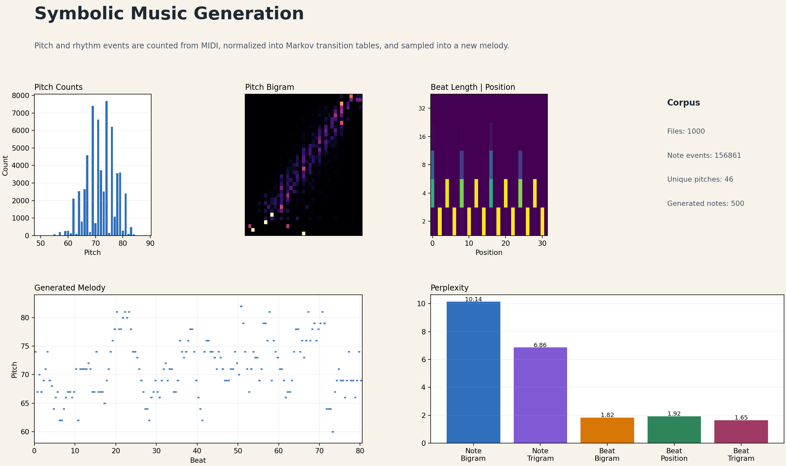

### Current Metrics

| Model | Predicted Event | Context | Mean Perplexity | Interpretation |
| --- | --- | --- | ---: | --- |
| pitch bigram | next pitch | previous pitch | `10.1369` | first order melodic baseline |
| pitch trigram | next pitch | previous two pitches | `6.8603` | stronger pitch model with local phrase memory |
| beat bigram | beat length | previous beat length | `1.8240` | rhythm only first order baseline |
| beat position | beat length | bar position | `1.9226` | position aware rhythm model used for generation |
| beat trigram | beat length | previous beat length and bar position | `1.6477` | strongest rhythm perplexity among the three |

Dataset and generation summary:

| Metric | Value |
| --- | ---: |
| `symbolic_file_count` | `1000` |
| `symbolic_note_event_count` | `156861` |
| `symbolic_unique_pitch_count` | `46` |
| `generated_q10_note_count` | `500` |
| `generated_length_matches_request` | `true` |

## Multitrack Transformer Generation

### Model

The multitrack generator represents every event with six fields:

```math
x_i = (\tau_i, b_i, r_i, p_i, d_i, c_i),
```

where `type` identifies song, instrument, note, and padding events; `beat` and `position` locate the onset; `pitch` and `duration` define the note; and `instrument` chooses one of piano, guitar, bass, strings, and brass.

The Transformer predicts the next event one field at a time:

```math
P_\theta(x_{i+1} \mid x_{\le i})
=
P(\tau)P(b)P(r)P(p)P(d)P(c).
```

Training uses cross entropy over all six fields. The notebook style evaluation reports test loss, overall accuracy, per field accuracy, and confusion matrices. The generation evaluation also compares the generated piece to the held out split using pitch class entropy, scale consistency, and groove consistency.

### Static Panel

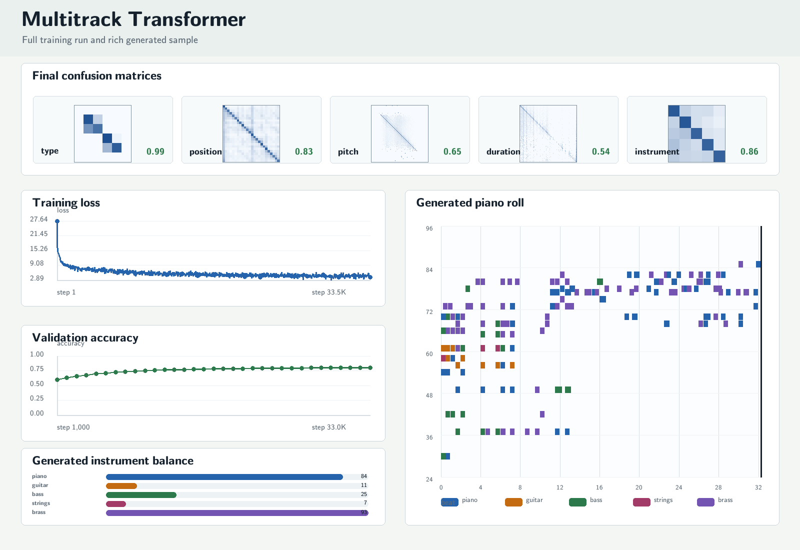

### Current Metrics

| Metric | Value |
| --- | ---: |
| `test_loss` | `4.2684` |
| `test_accuracy` | `0.8008` |
| `generated_notes` | `220` |
| `active_instruments` | `5` |
| `pitch_class_entropy` | `2.3506` |
| `scale_consistency_percent` | `100.0000` |
| `groove_consistency_percent` | `94.2708` |

Generated artifacts:

| Artifact | Path |
| --- | --- |
| MIDI | `outputs/multitrack_generation/generated/full_transformer_rich_selected/full_transformer_rich_selected.mid` |
| WAV preview | `outputs/multitrack_generation/generated/full_transformer_rich_selected/full_transformer_rich_selected.wav` |
| Generation summary | `outputs/multitrack_generation/generated/full_transformer_rich_selected/summary.json` |

## Diffusion-Based Music Generation

### Model

The diffusion music generator works on short NSynth audio chunks represented as complex STFT spectrograms. Each waveform is converted to a compressed complex spectrogram

```math
X_{\mathrm{norm}}[f,\tau]
=
\beta |X[f,\tau]|^\alpha e^{j\angle X[f,\tau]},
```

with `alpha = 0.5`, `beta = 1.0`, `129` frequency bins, and `63` time frames. The real and imaginary parts are stacked into a tensor

```math
x_0 \in \mathbb{R}^{2 \times 129 \times 63}.
```

The model is a pitch-conditioned flow matching network. During training, a clean spectrogram `x_0` and Gaussian noise `\epsilon` define the interpolation

```math
x_t = (1-t)x_0 + t\epsilon,
\qquad
t \in [0,1],
```

where `t = 0` is clean audio and `t = 1` is pure noise. The target velocity for the standard diffusion-time convention is

```math
v^*(x_t,t,p) = \epsilon - x_0,
```

and the network is trained with mean squared error:

```math
\mathcal{L}(\theta)
=
\mathbb{E}_{x_0,\epsilon,t,p}
\left[
\left\|
v_\theta(x_t,t,p) - v^*(x_t,t,p)
\right\|_2^2
\right].
```

Generation integrates from noise to data:

```math
x_{t-\Delta t}
=
x_t - \Delta t\,v_\theta(x_t,t,p).
```

The pitch index conditions the model with a MIDI pitch embedding. Classifier-free guidance uses a reserved null pitch token and combines conditional and unconditional velocities:

```math
v_{\mathrm{cfg}}
=
v_{\varnothing}
+ s\left(v_p - v_{\varnothing}\right),
```

where `s` is the guidance scale. The full run uses second-order Heun integration for the assignment samples:

```math
\tilde{x}_{t-\Delta t} = x_t - \Delta t\,v_{\mathrm{cfg}}(x_t,t,p),
```

```math
x_{t-\Delta t}
=
x_t
- \frac{\Delta t}{2}
\left[
v_{\mathrm{cfg}}(x_t,t,p)
+ v_{\mathrm{cfg}}(\tilde{x}_{t-\Delta t},t-\Delta t,p)
\right].
```

For the stronger pitch-guided generation, several solver and guidance settings are sampled for each requested pitch. Each candidate is scored with harmonic energy around the target MIDI pitch. If `H(p)` is the weighted mean energy around the harmonics of pitch `p`, then the local pitch scores are

```math
r_{\mathrm{target}} = \frac{H(p)}{\bar{E}},
\qquad
r_{\mathrm{margin}} =
\frac{H(p)-\max_{\delta \in \{-2,-1,1,2\}}H(p+\delta)}
{\left|\max_{\delta \in \{-2,-1,1,2\}}H(p+\delta)\right|+\epsilon}.
```

The selected candidate maximizes

```math
S
=
2.5\,r_{\mathrm{target}}
+ 1.5\,r_{\mathrm{margin}}
- \lambda_{\mathrm{artifact}},
```

where the artifact penalty rejects silent, unstable, non-finite, or extreme-amplitude spectra. This keeps the final samples pitch-aware while still using the same trained flow model.

### Animated Flow Panel


The GIF visualizes the learned flow rather than only a single endpoint. The left panel projects `24` generated examples through the same high-dimensional flow into a two-dimensional trajectory view. The highlighted path tracks one selected `D#4` guitar sample. The right side shows the current spectrogram, the vector-field energy map, and the waveform reconstructed from the current spectrogram. The final GIF is rendered with a light background, dark labels, `12` frames, and `280 ms` per frame so the diffusion trajectory can be read step by step.

### Static Result Panel

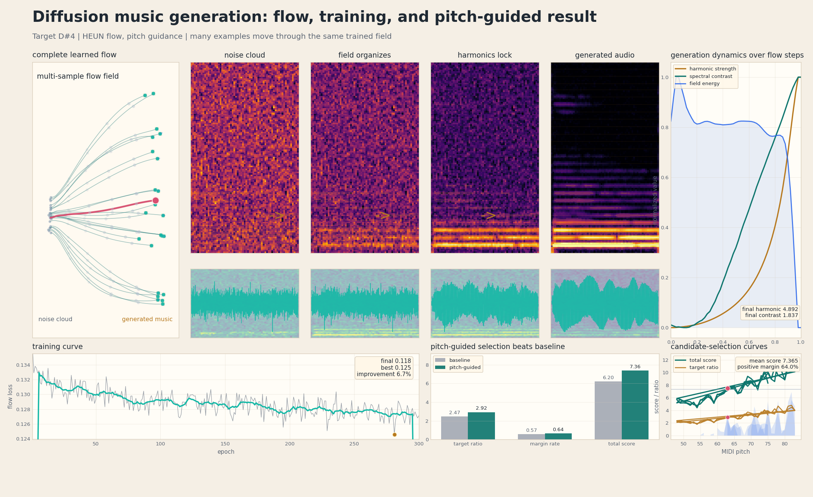

The static panel combines the flow projection, four formation stages, the reconstructed waveform, training loss, pitch-guided selection results, and candidate-selection curves. It is intended to be the main visual evidence panel for the diffusion run.

### Training Results

| Metric | Value |
| --- | ---: |
| source checkpoint | `data/diffusion_based_music_generation/pretrained_keyboard.pt` |
| fine-tuned checkpoint | `outputs/diffusion_based_music_generation/runs/q4_full_guitar/checkpoints/model_ft.pt` |
| training instrument filter | `guitar` |
| training files | `2000` |
| epochs | `300` |
| optimizer steps | `9300` |
| trainable parameters | `125202` |
| final step loss | `0.11796` |
| mean step loss | `0.12888` |
| first epoch loss | `0.13619` |
| best epoch | `281` |
| best epoch loss | `0.12459` |
| tail-30 mean epoch loss | `0.12730` |
| tail-30 epoch loss std | `0.00095` |
| relative improvement from epoch 1 | `6.66%` |

### Generation and Selection Results

| Metric | Value |
| --- | ---: |
| generated samples | `100` |
| pitch range | `48-83` |
| sample shape | `100 x 2 x 129 x 63` |
| generated sample std | `0.77841` |
| generated sample min / max | `-12.44025 / 12.89185` |
| distance from initial noise MSE | `1.39496` |
| mean per-sample L2 norm | `98.19986` |
| candidate count | `1200` |
| candidates per requested sample | `12` |
| selected setting count: `heun_50_gs5` | `97` |
| selected setting count: `rk4_50_gs65` | `1` |
| selected setting count: `rk4_32_gs6` | `2` |
| selected score mean | `7.36480` |
| selected score min / max | `4.40975 / 12.41991` |

### Pitch-Guided Method vs Baseline

Higher values are better for these local harmonic pitch-proxy scores.

| Metric | Notebook Baseline | Pitch-Guided Selection | Change |
| --- | ---: | ---: | ---: |
| mean target harmonic ratio | `2.46726` | `2.91795` | `+18.27%` |
| mean margin ratio | `0.02232` | `0.04661` | `+0.02428` |
| positive margin rate | `57.00%` | `64.00%` | `+7.00 pp` |
| mean total score | `6.20162` | `7.36480` | `+1.16317` |
| min total score | `3.31687` | `4.40975` | `+1.09288` |
| max total score | `11.81096` | `12.41991` | `+0.60895` |

### Visualization Run

| Metric | Value |
| --- | ---: |
| visualized sample index | `15` |
| visualized target note | `D#4` |
| visualized sampler | `heun` |
| visualized solver steps | `50` |
| visualized guidance scale | `5.0` |
| flow examples in projection | `24` |
| selected sample score | `7.50799` |
| visual score | `1.60846` |
| replay MSE vs saved sample | `0.0` |
| replay MAE vs saved sample | `0.0` |
| GIF frames | `12` |
| GIF frame duration | `280 ms` |

### Generated Artifacts

| Artifact | Path |
| --- | --- |
| fine-tuned model | `outputs/diffusion_based_music_generation/runs/q4_full_guitar/checkpoints/model_ft.pt` |
| assignment-style generated samples | `outputs/diffusion_based_music_generation/generated/q4_full_guitar/samples.npz` |
| pitch-guided samples | `outputs/diffusion_based_music_generation/beat_baseline_pitch_guided/pitch_guided_beat_baseline_samples.npz` |
| pitch-guided model copy | `outputs/diffusion_based_music_generation/beat_baseline_pitch_guided/pitch_guided_beat_baseline_model.pt` |
| candidate score table | `outputs/diffusion_based_music_generation/beat_baseline_pitch_guided/candidate_scores.csv` |
| selected candidate table | `outputs/diffusion_based_music_generation/beat_baseline_pitch_guided/selected_candidates.csv` |
| animated flow panel | `outputs/diffusion_based_music_generation/visuals/music_forming_flow/music_forming_over_diffusion_flow.gif` |
| static result panel | `outputs/diffusion_based_music_generation/visuals/music_forming_flow/music_forming_storyboard.png` |
| replayed flow trajectory | `outputs/diffusion_based_music_generation/visuals/music_forming_flow/replayed_flow_trajectory.npz` |
| audio snapshots | `outputs/diffusion_based_music_generation/visuals/music_forming_flow/audio_snapshots/` |

## Automatic Instrumentation

### Model

Automatic instrumentation is framed as note level part assignment. A processed arrangement is represented as an ordered event sequence

```math
\mathcal{X} = \{x_i\}_{i=1}^{N},
\qquad
x_i = (t_i, p_i, d_i),
```

where `t_i` is the quantized onset step, `p_i` is the MIDI pitch, and `d_i` is the quantized duration. The target label for each note is

```math
y_i \in \mathcal{C},
\qquad
\mathcal{C} = \{\text{piano},\text{guitar},\text{bass},\text{strings},\text{brass}\}.
```

The system flow is:

```text
existing multitrack MIDI
  -> cleaned symbolic note events
  -> single mixed note stream x_i = (onset, pitch, duration)
  -> note level instrument classifier
  -> predicted labels y_hat_i
  -> separated output parts for piano, guitar, bass, strings, and brass
```

The model predicts an instrument distribution for each event:

```math
P_\theta(y_i=c \mid x_{1:N}, i),
\qquad
\hat{y}_i = \arg\max_{c \in \mathcal{C}} P_\theta(y_i=c \mid x_{1:N}, i).
```

The fixed pitch zone baseline ignores sequence context and assigns labels from pitch alone:

```math
z(p_i)=
\begin{cases}
\text{bass}, & p_i < 44,\\
\text{guitar}, & 44 \le p_i < 72,\\
\text{piano}, & 72 \le p_i < 83,\\
\text{strings}, & 83 \le p_i < 105,\\
\text{brass}, & p_i \ge 105.
\end{cases}
```

The learned models embed pitch, duration, beat, and position features before classification:

```math
e_i =
E_p(p_i) + E_d(d_i) + E_b(\lfloor t_i / 24 \rfloor) + E_r(t_i \bmod 24).
```

The per note MLP estimates each `y_i` independently from `e_i`. The online LSTM and causal Transformer estimate `y_i` using only current and previous events, while the offline BiLSTM and offline Transformer can use both left and right context:

```math
h_i^{\text{online}} = f_\theta(e_1,\ldots,e_i),
\qquad
h_i^{\text{offline}} = f_\theta(e_1,\ldots,e_N)_i.
```

All learned models are trained with token level cross entropy over the note labels:

```math
\mathcal{L}(\theta)
=
-\frac{1}{N}
\sum_{i=1}^{N}
\log P_\theta(y_i \mid x_{1:N}, i).
```

The final arrangement is reconstructed by routing each input note to the predicted output part:

```math
\mathcal{P}_c
=
\{x_i : \hat{y}_i = c\},
\qquad
c \in \mathcal{C}.
```


### Final Static Evidence Panel

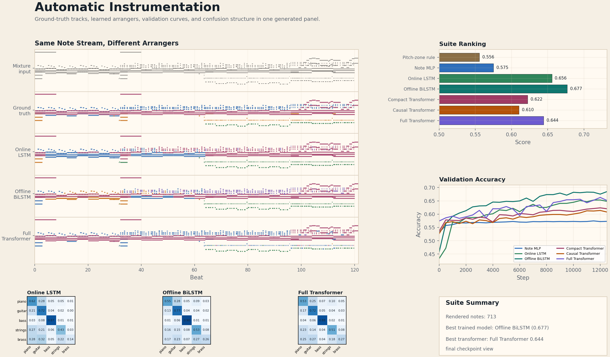

The final static panel keeps the complete evidence view in one place: input mixture, ground truth labels, model prediction rows, suite ranking, validation curve, and a confusion matrix wall for the main sequence models.

### Full Model Comparison

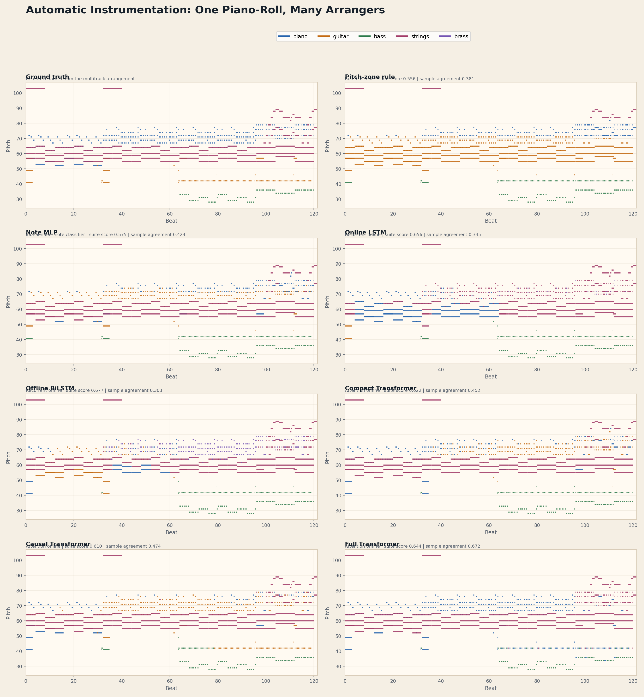

This comparison expands the prediction roll view to the full suite so the rule baseline, independent classifier, recurrent models, and Transformer variants can be inspected on the same sample.

### Evaluation Table

| Model | Family | Context | Best Val Loss | Final Val Loss | Validation / Rule Score | Visual Sample Agreement |
| --- | --- | --- | ---: | ---: | ---: | ---: |
| `pitch_zones` | fixed pitch zone rule | pitch only | `n/a` | `n/a` | `0.5555` | `0.3815` |
| `note_mlp` | independent note classifier | per note | `1.0424` | `1.0454` | `0.5750` | `0.4236` |
| `sequence_lstm` | online recurrent model | past and current notes | `0.8575` | `0.8575` | `0.6557` | `0.3450` |
| `bidirectional_lstm` | offline bidirectional recurrent model | past and future notes | `0.7895` | `0.8168` | `0.6767` | `0.3029` |
| `compact_transformer` | compact offline attention model | full sequence attention | `0.9242` | `0.9401` | `0.6223` | `0.4516` |
| `causal_transformer` | online causal attention model | masked past attention | `0.9390` | `0.9583` | `0.6103` | `0.4741` |
| `full_transformer` | full offline attention model | full sequence attention | `0.8608` | `0.8949` | `0.6442` | `0.6718` |

The visualization panel uses a 713 note sample from the processed automatic instrumentation dataset. Its animation samples saved training checkpoints for the online LSTM, offline BiLSTM, and full Transformer rows, while the final static panel shows the model ranking, validation curves, and a three model confusion matrix wall.

## Automatic Playlist Continuation

### Model

Automatic playlist continuation is framed as implicit feedback recommendation. A playlist collection is represented as

```math
\mathcal{P} = \{P_u\}_{u=1}^{U},
\qquad
P_u = \{t_{u,1}, t_{u,2}, \ldots, t_{u,L_u}\},
```

where `u` indexes playlists and `t` indexes track ids. The training set contains one positive interaction for every observed playlist track pair:

```math
y_{ui}=1
\quad \text{if track } i \in P_u.
```

Because the unobserved playlist track matrix is too large to enumerate, the workflow samples negative items uniformly from tracks not present in the playlist:

```math
y_{uj}=0
\quad \text{for sampled } j \notin P_u.
```

The current run uses one sampled negative for each positive, giving `148,837` positive rows, `148,837` negative rows, and `297,674` total interaction rows.

The collaborative model is a weighted regularized matrix factorization model. Each playlist has a latent vector

```math
p_u \in \mathbb{R}^{d},
```

and each track has a latent vector

```math
q_i \in \mathbb{R}^{d}.
```

The raw compatibility score is an inner product:

```math
s_{ui} = p_u^\top q_i.
```

The implementation maps that score through a sigmoid to make the predicted preference bounded:

```math
\hat{y}_{ui} = \sigma(s_{ui})
= \frac{1}{1 + e^{-s_{ui}}}.
```

Observed positives are weighted more strongly than sampled negatives with

```math
c_{ui} = 1 + \alpha y_{ui},
```

where this run uses `alpha = 40.0`. The training objective is

```math
\mathcal{L}(\theta)
=
\frac{1}{|\mathcal{D}|}
\sum_{(u,i,y_{ui}) \in \mathcal{D}}
c_{ui}\left(y_{ui}-\hat{y}_{ui}\right)^2
+
\lambda
\left(
\frac{1}{|\mathcal{B}|}\sum_{u \in \mathcal{B}}\|p_u\|_2^2
+
\frac{1}{|\mathcal{B}|}\sum_{i \in \mathcal{B}}\|q_i\|_2^2
\right),
```

with `lambda = 0.1`, `d = 16`, `batch_size = 1024`, `learning_rate = 0.01`, and `epochs = 10`. The model is optimized with Adam. In this run the loss moved from `4.3363` at epoch 1 to `0.8170` at epoch 10.

For evaluation, each held out playlist is split into a short query seed and a target continuation:

```math
Q_u = (t_{u,1}, t_{u,2}),
\qquad
T_u = (t_{u,3}, \ldots, t_{u,L_u}).
```

The learned query representation averages the trained track factors for the query tracks:

```math
z_u =
\frac{1}{|Q_u|}
\sum_{i \in Q_u} q_i.
```

Candidate tracks are then ranked by cosine similarity to the query representation, excluding tracks already present in the query:

```math
\mathrm{score}(j \mid Q_u)
=
\frac{z_u^\top q_j}{\|z_u\|_2\|q_j\|_2},
\qquad
j \notin Q_u.
```

The ranked continuation list is

```math
R_u = \mathrm{argsort}_{j \notin Q_u}
\left[-\mathrm{score}(j \mid Q_u)\right].
```

The audio baseline uses the same retrieval shape but replaces learned WRMF factors with precomputed audio embeddings. For each track embedding

```math
e_i \in \mathbb{R}^{m},
```

the query audio vector is

```math
a_u =
\frac{1}{|Q_u|}
\sum_{i \in Q_u} e_i,
```

and the audio score is

```math
\mathrm{score}_{\mathrm{audio}}(j \mid Q_u)
=
\frac{a_u^\top e_j}{\|a_u\|_2\|e_j\|_2}.
```

This makes the comparison strict: both systems rank by cosine similarity from the same query/target split, but one uses collaborative playlist structure and the other uses acoustic embedding similarity.

### Ranking Metrics

For a playlist `u`, let `R_{u,k}` be the top `k` recommended tracks and let `T_u` be the hidden target set. Precision at `k` is

```math
\mathrm{Precision@k}(u)
=
\frac{|R_{u,k} \cap T_u|}{k}.
```

The target normalized precision used in the reports is also recall at `k`:

```math
\mathrm{TargetP@k}(u)
=
\mathrm{Recall@k}(u)
=
\frac{|R_{u,k} \cap T_u|}{|T_u|}.
```

Hit rate at `k` measures whether at least one hidden target appears in the first `k` recommendations:

```math
\mathrm{Hit@k}(u)
=
\mathbf{1}\{|R_{u,k} \cap T_u| > 0\}.
```

For a target track `t`, its reciprocal rank is

```math
\mathrm{RR}(t, R_u)
=
\begin{cases}
\frac{1}{\mathrm{rank}_{R_u}(t)} & \text{if } t \in R_u, \\
0 & \text{otherwise.}
\end{cases}
```

The project reports playlist MRR by averaging reciprocal rank over the target tracks and then averaging over playlists:

```math
\mathrm{MRR}
=
\frac{1}{U}
\sum_{u=1}^{U}
\frac{1}{|T_u|}
\sum_{t \in T_u}
\mathrm{RR}(t, R_u).
```

Let `r_{u,n}` be the track id at rank `n` in `R_u`. Average precision at `k` rewards early hits:

```math
\mathrm{AP@k}(u)
=
\frac{1}{\min(|T_u|, k)}
\sum_{n=1}^{k}
\mathrm{Precision@n}(u)
\mathbf{1}\{r_{u,n} \in T_u\}.
```

NDCG at `k` discounts later hits logarithmically:

```math
\mathrm{DCG@k}(u)
=
\sum_{n=1}^{k}
\frac{\mathbf{1}\{r_{u,n} \in T_u\}}{\log_2(n+1)},
```

```math
\mathrm{NDCG@k}(u)
=
\frac{\mathrm{DCG@k}(u)}
{\sum_{n=1}^{\min(|T_u|, k)}\frac{1}{\log_2(n+1)}}.
```

### Visual Evidence

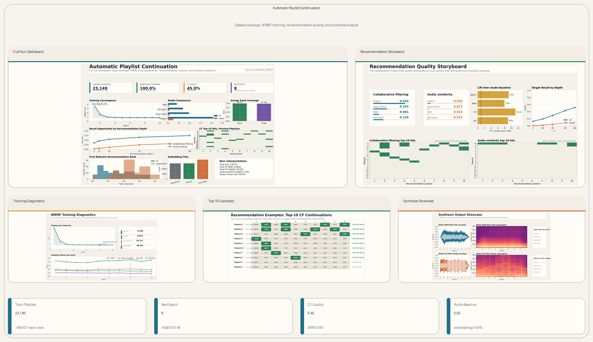

The static panel keeps the final run evidence in one view: dataset coverage, training convergence, model comparison, first relevant rank distribution, top 10 hit examples, embedding coverage, and improved synthesis evidence.

The animated panel is generated from the metrics rather than from static screenshots. Each frame advances the run state: the loss curve extends over epochs, validation metrics move with training, CF/audio depth curves reveal more ranks, quality bars grow in, and the recommendation hit matrix opens from rank 1 through rank 10.

### Current Run Metrics

| Metric | Value |
| --- | ---: |
| train playlists | `23,149` |
| train track rows | `148,837` |
| unique train tracks | `15,316` |
| test playlists | `100` |
| test target tracks | `457` |
| interaction rows | `297,674` |
| query known rate | `98.50%` |
| target known rate | `97.37%` |
| selected embedding files present | `15,331 / 15,331` |
| best validation epoch | `8` |
| best validation Hit@10 | `0.46` |
| final training loss | `0.8170` |
| final validation Hit@10 | `0.45` |
| final validation TargetP@10 | `0.1930` |
| final validation MRR | `0.0815` |

| Recommender | Hit@10 | TargetP@10 / Recall@10 | MRR | MAP@10 | NDCG@10 | Median First Relevant Rank | Hit@100 |
| --- | ---: | ---: | ---: | ---: | ---: | ---: | ---: |
| collaborative filtering WRMF | `0.45` | `0.1930` | `0.0815` | `0.0806` | `0.1393` | `15.0` | `0.74` |
| audio similarity baseline | `0.05` | `0.0173` | `0.0103` | `0.0084` | `0.0152` | `229.5` | `0.34` |

The WRMF recommender is therefore `9.0x` higher than the audio baseline on Hit@10 for this run. The audio baseline has broad catalog coverage, but it does not recover held out continuation tracks nearly as early in the ranked list.

### Generated Artifacts

| Artifact | Path |
| --- | --- |
| README animated panel | `outputs/automatic_playlist_continuation/full_run_20260422_002634/readme/readme_automatic_playlist_continuation_animated_panel.gif` |
| README static panel | `outputs/automatic_playlist_continuation/full_run_20260422_002634/readme/readme_automatic_playlist_continuation_static_panel.png` |
| metric summary | `outputs/automatic_playlist_continuation/full_run_20260422_002634/metrics/playlist_continuation_summary.json` |
| training/validation curve | `outputs/automatic_playlist_continuation/full_run_20260422_002634/metrics/training_validation_curve.json` |
| CF ranking preview | `outputs/automatic_playlist_continuation/full_run_20260422_002634/rankings/collaborative_filtering_preview.csv` |
| audio ranking preview | `outputs/automatic_playlist_continuation/full_run_20260422_002634/rankings/audio_similarity_preview.csv` |
| improved warm pad WAV | `outputs/automatic_playlist_continuation/full_run_20260422_002634/synthesis/better_adsr_warm_pad.wav` |
| improved LFO sweep WAV | `outputs/automatic_playlist_continuation/full_run_20260422_002634/synthesis/better_lfo_filter_sweep.wav` |

## Evaluation

The evaluation folder stays table first:

| Metric | Value |
| --- | ---: |
| `audio_clip_count` | `5` |
| `lead_note_count` | `9` |
| `sample_rate` | `44100` |
| `delay_tail_seconds` | `0.5000` |
| `baseline_accuracy` | `1.0000` |
| `enhanced_accuracy` | `1.0000` |
| `baseline_seed_sweep_mean` | `0.9635` |
| `enhanced_seed_sweep_mean` | `1.0000` |
| `baseline_seed_sweep_min` | `0.9167` |
| `enhanced_seed_sweep_min` | `1.0000` |
| `row_count` | `240` |
| `spectrogram_clip_count` | `821` |
| `spectrogram_binary_best_accuracy` | `0.9919` |
| `spectrogram_four_class_accuracy` | `0.9355` |
| `symbolic_file_count` | `1000` |
| `symbolic_note_event_count` | `156861` |
| `symbolic_unique_pitch_count` | `46` |
| `symbolic_note_bigram_perplexity` | `10.1369` |
| `symbolic_note_trigram_perplexity` | `6.8603` |
| `symbolic_beat_bigram_perplexity` | `1.8240` |
| `symbolic_beat_position_perplexity` | `1.9226` |
| `symbolic_beat_trigram_perplexity` | `1.6477` |
| `symbolic_generated_note_count` | `500` |
| `multitrack_test_loss` | `4.2684` |
| `multitrack_test_accuracy` | `0.8008` |
| `multitrack_generated_note_count` | `220` |
| `multitrack_active_instruments` | `5` |
| `multitrack_pitch_class_entropy` | `2.3506` |
| `multitrack_scale_consistency_percent` | `100.0000` |
| `multitrack_groove_consistency_percent` | `94.2708` |
| `diffusion_training_files` | `2000` |
| `diffusion_epochs_completed` | `300` |
| `diffusion_optimizer_steps` | `9300` |
| `diffusion_final_loss` | `0.11796` |
| `diffusion_generated_sample_count` | `100` |
| `diffusion_distance_from_noise_mse` | `1.39496` |
| `diffusion_pitch_guided_mean_target_ratio` | `2.91795` |
| `diffusion_baseline_mean_target_ratio` | `2.46726` |
| `diffusion_target_ratio_gain_percent` | `18.2672` |
| `diffusion_positive_margin_rate` | `0.6400` |
| `diffusion_visualized_flow_examples` | `24` |
| `automatic_instrumentation_best_score` | `0.6767` |
| `automatic_instrumentation_best_model` | `bidirectional_lstm` |
| `automatic_instrumentation_best_transformer_score` | `0.6442` |
| `automatic_playlist_train_playlists` | `23149` |
| `automatic_playlist_interaction_rows` | `297674` |
| `automatic_playlist_best_epoch` | `8` |
| `automatic_playlist_best_hit_at_10` | `0.4600` |
| `automatic_playlist_cf_hit_at_10` | `0.4500` |
| `automatic_playlist_cf_mrr` | `0.0815` |
| `automatic_playlist_audio_hit_at_10` | `0.0500` |
| `automatic_playlist_audio_mrr` | `0.0103` |

## License

This project is released under the MIT License. See [LICENSE](LICENSE).
